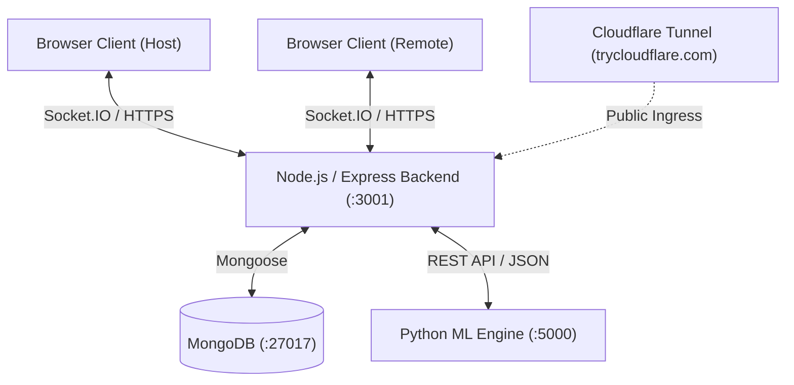

# CollabLens — Real-Time Collaborative Workspace with AI-Driven Team Dynamics and Contribution Analysis

CollabLens is an intelligent, real-time collaboration platform designed to enhance team productivity and provide deep insights into team dynamics. It combines a multi-user workspace (real-time chat, collaborative Excalidraw whiteboard, live Monaco code editor) with an AI-powered analytics engine that evaluates participation quality, detects when teams are stuck, maps communication networks, and generates actionable post-session intelligence reports.

---

## 🌟 Key Features

- **Real-Time Multi-User Collaboration**: Instant messaging, synchronized drawing (Excalidraw), and synchronized code editing (Monaco) powered by Socket.IO.
- **AI-Driven Analytics Engine**: Natural language processing, zero-shot intent classification, Sentence Transformers (`all-MiniLM-L6-v2`), and DBSCAN clustering to evaluate topic progression.
- **Team Dynamics Mapping**: NetworkX force-directed communication density graphs to visualize interaction patterns and identify isolated or dominant participants.
- **Temporal Stuck Detection**: 4-signal sliding-window algorithm detecting team deadlocks based on sentiment drops, topic stagnation, and message cadence.
- **Contribution Quality Scoring**: Multi-dimensional equity evaluation calculating Gini coefficients, idea-generation metrics, and collaboration efficiency.
- **Session Lifecycle & Rejoin System**: Host controls (Start/End/Kick/Transfer), countdown timer synchronization, and a Google Meet-style knock-to-admit rejoin flow.

---

## 🏗️ Architecture



- **Frontend**: React 18, TypeScript, Vite, Zustand, Socket.IO Client, Excalidraw, Monaco Editor, Lucide Icons.
- **Backend**: Node.js, Express, Socket.IO, MongoDB, Mongoose, JWT Authentication.
- **ML Intelligence Service**: Python 3.10+, Flask, HuggingFace Transformers, scikit-learn, SentenceTransformers, NetworkX.
- **Tunneling / Networking**: Cloudflare Tunnel (`cloudflared`) and local HTTPS certificates.

---

## 🚀 Getting Started

### Prerequisites
- **Node.js**: v18.0.0 or higher
- **Python**: v3.9 or higher (with pip and virtualenv)
- **MongoDB**: Community Server running locally or MongoDB Atlas connection URI
- **Cloudflared CLI**: (Optional, for remote multi-device sharing) [Download Cloudflared](https://developers.cloudflare.com/cloudflare-one/connections/connect-networks/downloads/)

---

### Step-by-Step Setup

#### 1. Start MongoDB
Ensure MongoDB is running locally on port 27017:
```bash
mongod
```

#### 2. Backend Setup (Node.js)
```bash
cd backend
npm install
npm run dev
```
*Backend runs on `http://localhost:3001`.*

#### 3. Frontend Setup (React / Vite)
```bash
cd frontend
npm install
npm run dev
```
*Frontend runs on `http://localhost:5173` (or `https://localhost:5173`).*

#### 4. Python ML Service Setup
```bash
cd ml-service
python -m venv venv

# Activate virtual environment:
# Windows (cmd/PowerShell):
venv\Scripts\activate
# macOS/Linux:
source venv/bin/activate

pip install -r requirements.txt
python app.py
```
*ML Service runs on `http://localhost:5000` (or `http://localhost:5001`).*

---

## 🌐 Remote Multi-Device Testing via Cloudflare Tunnel

To host the platform and connect multiple laptops / remote devices over the internet:

1. Ensure the backend and frontend are running locally.
2. In a separate terminal, launch a public Cloudflare tunnel:
   ```bash
   cloudflared tunnel --url http://localhost:3001
   ```
3. Cloudflare will output a public URL (e.g., `https://<random-name>.trycloudflare.com`).
4. Share this link with team members on other devices to join the collaborative workspace in real-time.

---

## 🔐 Environment Variables Configuration

Create a `.env` file in each directory as follows:

**`backend/.env`**
```env
MONGO_URI=mongodb://localhost:27017/collab-lens
PORT=3001
ML_SERVICE_URL=http://localhost:5000
JWT_SECRET=your_secure_jwt_secret_key_2026
FRONTEND_URL=http://localhost:5173
```

**`ml-service/.env`**
```env
PORT=5000
```

---

## 📊 Current Feature Status & Known Limitations

| Module | Status | Description |
| :--- | :---: | :--- |
| **Authentication & Users** | ✅ Complete | JWT login, registration, password hashing, and user persistence. |
| **Real-Time Core** | ✅ Complete | Room create/join, timer sync, real-time chat, and toast alerts. |
| **Whiteboard (Excalidraw)** | ✅ Complete | Synchronized collaborative drawing with MongoDB persistence. |
| **Code Editor (Monaco)** | ✅ Complete | Multi-language real-time code editor with language switching. |
| **Rejoin & Lifecycle** | ✅ Complete | Google Meet knock-to-admit flow, host transfer, and kick controls. |
| **ML Intelligence Engine** | ✅ Complete | 8 analysis modules, post-session reports, 9/9 benchmark tests. |
| **Remote Speech Recognition** | ⚠️ Incomplete | Chrome Web Speech API operates on local host; exhibits network errors over remote tunnels. |
| **WebRTC Multi-Device Streaming**| ⚠️ Incomplete | P2P mesh video/audio streaming across remote laptops experiences asymmetric track renegotiation and NAT issues. Migration to an SFU (e.g. LiveKit / mediasoup) is recommended for production. |

---

## 📝 License
This project is licensed under the MIT License.
